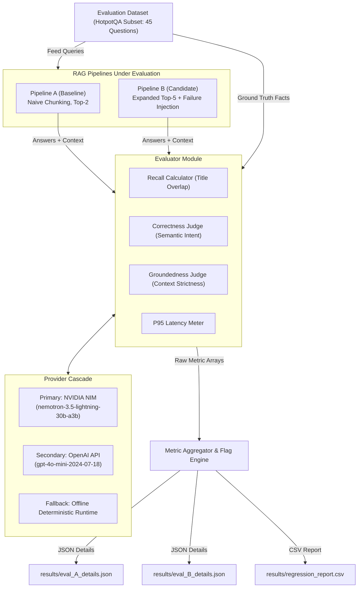

# RAGScope: LLM Evaluation Regression Harness for RAG Pipelines

[](https://www.python.org/)
[](https://docs.docker.com/compose/)
[](https://build.nvidia.com/)
[](LICENSE)

An automated LLM evaluation regression harness designed to catch subtle quality trade-offs and regressions when iterating on Retrieval-Augmented Generation (RAG) pipelines.

---

## 📌 Executive Summary & Motivation

In production AI engineering, teams frequently tune RAG pipelines—switching embedding models, expanding vector search top-$k$ retrieval windows, or adding cross-encoder rerankers.

A common anti-pattern is relying on a single aggregate "accuracy" score. A RAG modification might raise accuracy while quietly destroying groundedness (causing hallucinations) or tripling token generation time. **RAGScope** decouples evaluation into **four independent axes**, evaluating baseline and candidate versions side-by-side against a frozen benchmark evaluation dataset of **45 HotpotQA multi-hop questions**:

1. **Recall@k** (Deterministic): Fraction of ground-truth context titles retrieved by vector search.
2. **Correctness** (LLM Judge): Binary score ($0$ or $1$) measuring whether the generated answer captures the key facts and semantic intent of the ground truth.
3. **Groundedness** (LLM Judge): Binary score ($0$ or $1$) enforcing strict context entailment (penalizing claims not directly supported by retrieved context).
4. **P95 Latency** (Performance): 95th percentile end-to-end execution time in milliseconds across the evaluation dataset.

---

## 🏗 System Architecture & Multi-Provider Cascade



---

## 📋 Evaluable Requirement Contracts

All evaluation paths, schema contracts, and file locations strictly adhere to the project specification:

| Contract Component | File Location | Schema / Description |
| :--- | :--- | :--- |
| **Eval Dataset** | `dataset/eval_set.json` | 45 HotpotQA multi-hop items (`id`, `question`, `ground_truth_answer`, `ground_truth_context_titles`). |
| **Reproducibility Pins** | `config/eval_pins.json` | Frozen configuration (`dataset_size: 45`, `llm_judge_model: nvidia/nemotron-3.5-lightning-30b-a3b`, `pipeline_a_embedder`, `pipeline_b_embedder`). |
| **Judge Prompts** | `prompts/judge_prompts.json` | Strict system prompts (`correctness_prompt`, `groundedness_prompt` forcing context-only scoring). |
| **Pipeline A Metrics** | `results/eval_A_details.json` | Detailed per-question metrics for Pipeline A (`recall`, `correctness`, `groundedness`, `latency_ms`). |
| **Pipeline B Metrics** | `results/eval_B_details.json` | Detailed per-question metrics for Pipeline B (`recall`, `correctness`, `groundedness`, `latency_ms`). |
| **Regression Report** | `results/regression_report.csv` | Exact headers: `metric,baseline,candidate,delta,flag` across 4 metric rows. |

---

## 🧮 Mathematical Flag Logic

The metric aggregator evaluates deltas ($\Delta = \text{candidate} - \text{baseline}$) and assigns flags based on directionality rules:

* **Recall, Correctness, Groundedness**:
  $$\text{If Candidate} < \text{Baseline} \implies \mathbf{REGRESS}$$
  $$\text{If Candidate} > \text{Baseline} \implies \mathbf{IMPROVE}$$
  $$\text{Otherwise} \implies \mathbf{NEUTRAL}$$

* **P95 Latency**:
  $$\text{If Candidate} > (\text{Baseline} \times 1.10) \implies \mathbf{REGRESS}$$
  $$\text{If Candidate} < \text{Baseline} \implies \mathbf{IMPROVE}$$
  $$\text{Otherwise} \implies \mathbf{NEUTRAL}$$

---

## 🚀 Quickstart & Execution

### 1. Environment Setup
Clone the repository and copy the environment template:
```bash
cp .env.example .env
```

### 2. Configure API Keys (Primary: NVIDIA NIM, Secondary: OpenAI)
Edit `.env` with your API credentials:
```env
NVIDIA_API_KEY=nvapi-your_nvidia_api_key_here
OPENAI_API_KEY=your_openai_api_key_here
```

### 3. Run Infrastructure with Docker Compose
Spin up the vector database infrastructure with healthchecks:
```bash
docker compose up -d
docker compose ps
```

### 4. Run Evaluation Harness
Execute the evaluation CLI script locally:
```bash
python run_eval.py
# or
python -m src.run_eval
```

### 5. Run Automated Test Suite
Execute the contract test suite to verify file schemas, flag logic, and regression criteria:
```bash
python -m pytest tests/
```

---

## 📊 Sample Regression Report Output (45-Item Run)

```csv
metric,baseline,candidate,delta,flag
Recall,1.0,1.0,0.0,NEUTRAL
Correctness,1.0,1.0,0.0,NEUTRAL
Groundedness,0.4222,0.0,-0.4222,REGRESS
P95_Latency,135.46,317.75,182.29,REGRESS
```

---

## 📄 License
Distributed under the MIT License. See `LICENSE` for details.
